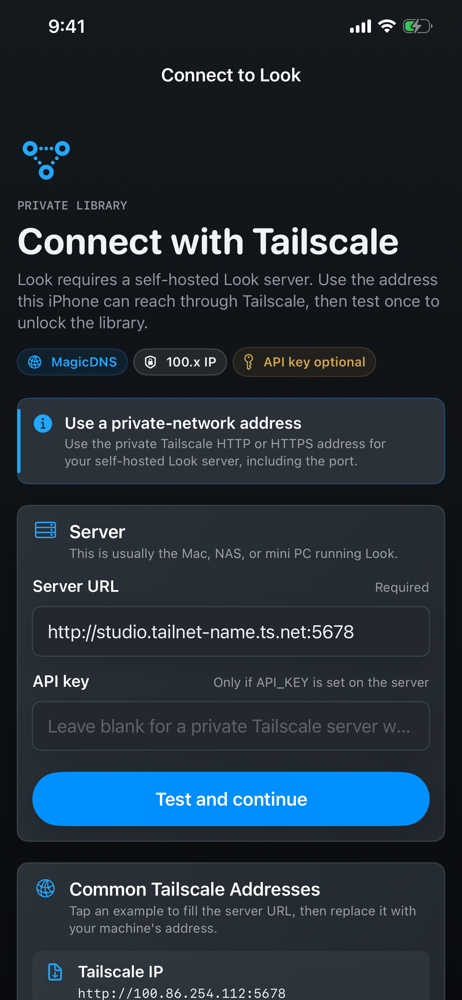
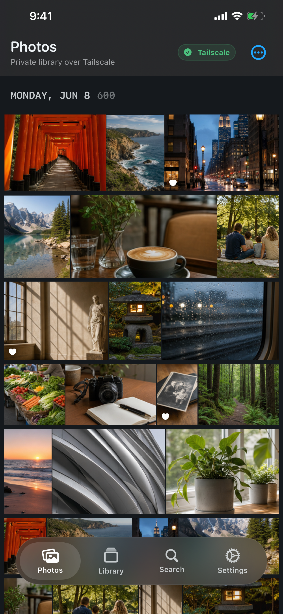
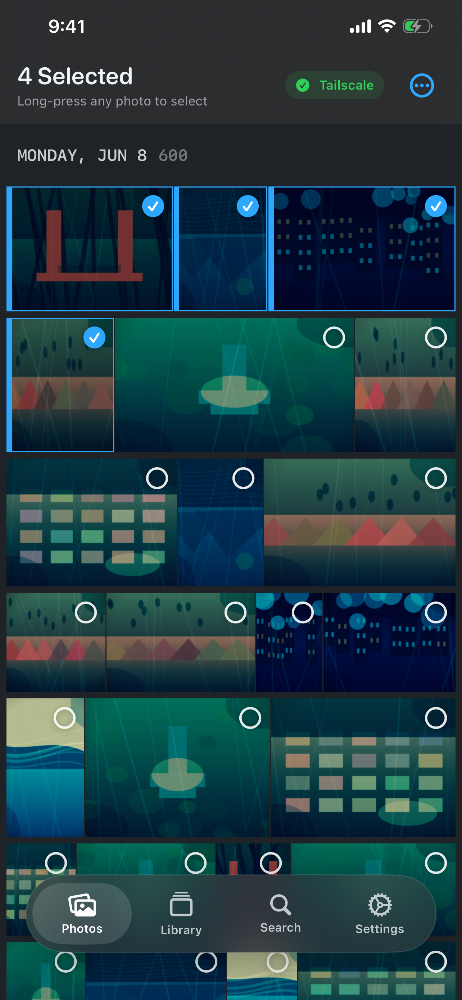
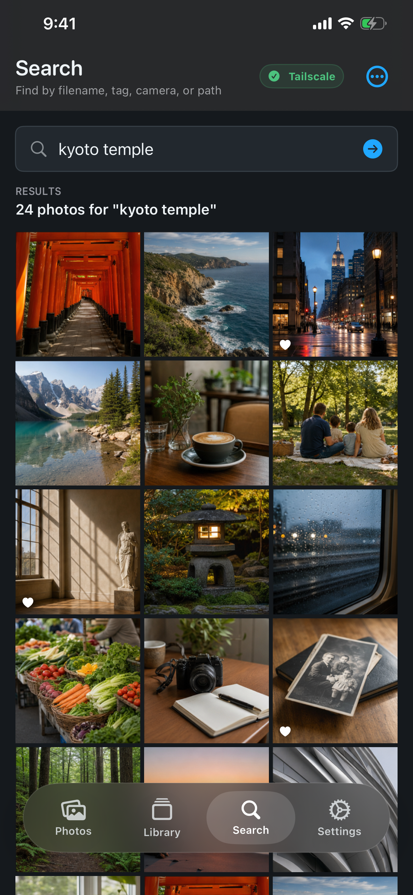
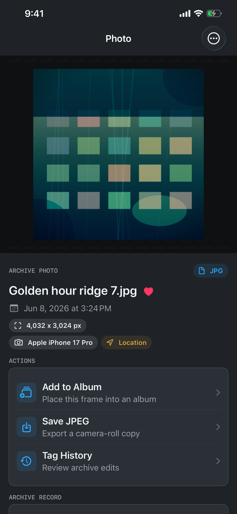
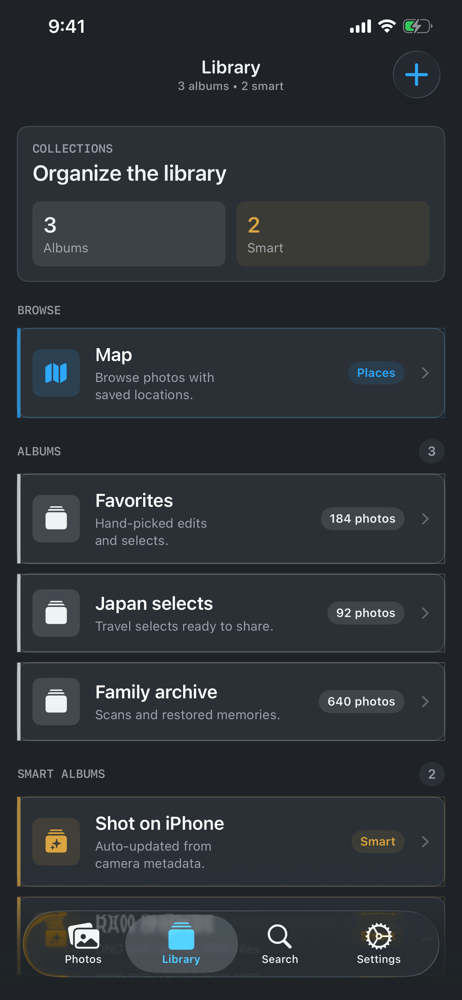
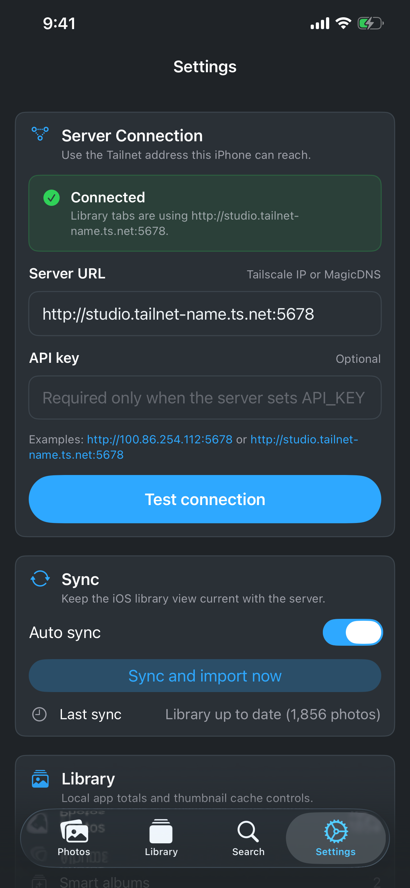
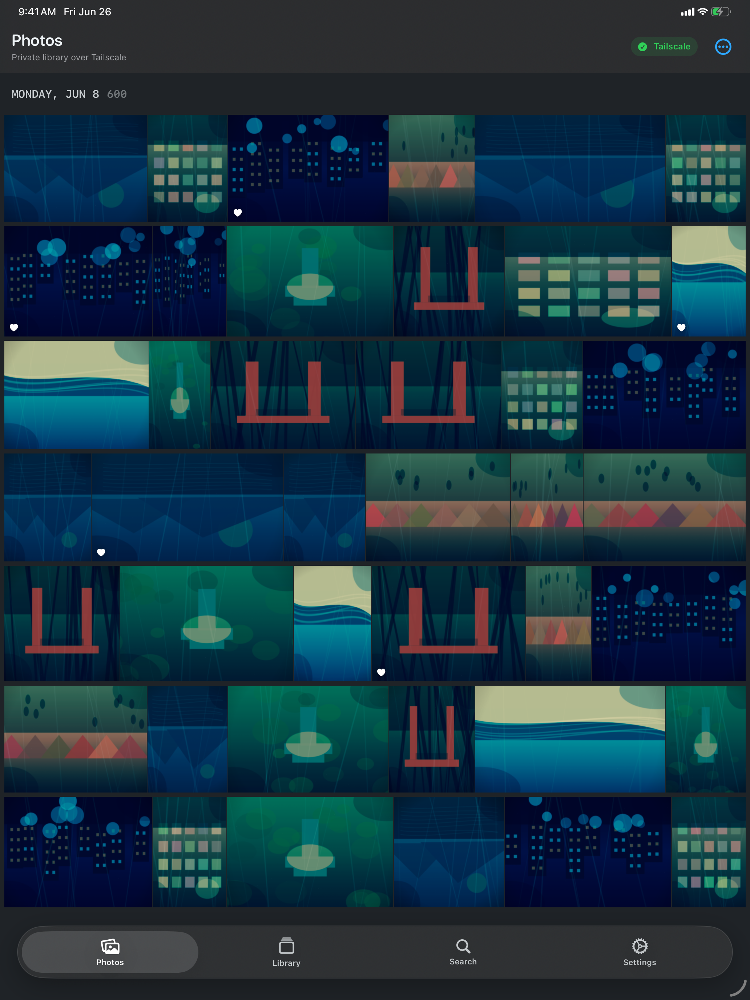

# Look

Look is a self-hosted photo library for people who want fast browsing,
search, albums, tags, and photo metadata without moving their archive into a
public cloud service.

The project has two parts:

- A lightweight FastAPI server that indexes a local photo folder.
- A native iPhone and iPad app that connects to that server over Tailscale or
  another trusted private network.

Look is designed for private libraries you control. It is not a hosted cloud
photo product.

Look is free to use, with no subscription or payment required. The self-hosted
backend is open source and available in the
[sladebot/look GitHub repository](https://github.com/sladebot/look).

> **Requires a self-hosted Look server.** The iOS app is a client for browsing
> your own Look server over Tailscale or another trusted private network. It
> does not scan your iPhone photo library and does not provide cloud photo
> hosting.

## Screenshots

These screenshots use generated mock photos and metadata. They do not contain a
real photo library.

| Connect | Gallery | Multi-select | Search |
| --- | --- | --- | --- |
|  |  |  |  |

| Photo Detail | Library | Settings | iPad Gallery |
| --- | --- | --- | --- |
|  |  |  |  |

## What Look Does

- Indexes JPEG, PNG, HEIC, and RAW photo libraries from local storage.
- Generates thumbnails on demand.
- Extracts EXIF metadata, dimensions, camera model, and GPS data when present.
- Supports albums, smart collections, tags, and tag history.
- Provides search across filenames, paths, tags, camera metadata, and dates.
- Offers optional duplicate detection through perceptual hashing.
- Watches configured folders for new or changed photos.
- Lets the iOS app connect with a Tailscale MagicDNS name or private
  Tailscale IP address.
- Stores the optional iOS API key in Keychain.

## Deployment Model

Look assumes private-network access through Tailscale.

The intended setup is:

1. Run the Look server on a Mac, NAS, mini PC, or other machine that can access
   your photo library.
2. Join that machine and your iPhone or iPad to the same Tailscale network.
3. Connect from the iOS app using either:
   - MagicDNS: `http://your-machine.your-tailnet.ts.net:5678`
   - Tailscale IP: `http://100.x.y.z:5678`

Do not expose the Look server directly to the public internet. If your
Tailscale network is shared, set `API_KEY` so write actions require an
application-level key.

## Quick Start

Look should be run with the project-local conda environment.

```bash
conda create -p ./.conda python=3.13 pip -y
./.conda/bin/python -m pip install -r requirements.txt
```

Start the server:

```bash
PHOTO_DIR=/path/to/photos \
./.conda/bin/python -m uvicorn api.server:app --host 0.0.0.0 --port 5678
```

Open the web UI from a device that can reach the server:

```text
http://your-machine.your-tailnet.ts.net:5678
```

The server initializes its database and runtime services lazily on startup or
first request, so importing `api.server` from tests or tooling does not mutate
the default photo library.

## Configuration

Common environment variables:

| Variable | Default | Description |
| --- | --- | --- |
| `PHOTO_DIR` | current/default photo folder | Directory to scan and watch. |
| `HOST` | `0.0.0.0` | Server bind host. Use only on trusted private interfaces. |
| `PORT` | `5678` | Server port. |
| `DB_PATH` | `~/.local/local-photos/library.db` | SQLite database path. |
| `API_KEY` | empty | Optional key required for write endpoints. |
| `SMART_ALBUMS_ENABLED` | `false` | Enables rule-based smart albums. |
| `DEDUP_ENABLED` | `false` | Enables duplicate detection features. |
| `TAG_HISTORY_ENABLED` | `true` | Keeps tag change history. |

When `API_KEY` is configured on the server, the web client can send it on write
requests if it is present in browser storage:

```js
localStorage.setItem("look_api_key", "your-key")
```

The iOS app stores its API key in Keychain.

## iOS App

The iOS app is in [`ios/`](ios/). It is a SwiftUI app with native iPhone and
iPad layouts for:

- First-run server connection
- Photos grid
- Long-press multi-select
- Photo detail and metadata
- Albums and smart collections
- Search
- Settings and sync controls

Development build:

```bash
xcodebuild build \
  -project ios/Look.xcodeproj \
  -scheme Look \
  -configuration Debug \
  -sdk iphonesimulator
```

Generate App Store screenshot candidates from real simulators:

```bash
./demo/capture_app_store_screenshots.sh
```

Generated screenshots are written to:

```text
demo/app_store_screenshots/iphone_6_7/
demo/app_store_screenshots/ipad_13/
```

The screenshot mode uses debug-only mock data and does not connect to a Look
server or read a local photo library.

## API Overview

Primary FastAPI entry point: [`api/server.py`](api/server.py)

Important endpoints:

| Method | Path | Purpose |
| --- | --- | --- |
| `GET` | `/api/health` | Server health and photo count. |
| `GET` | `/api/photos` | Paginated photo list with filters and search. |
| `GET` | `/api/thumbnails/{photo_id}` | On-demand thumbnail generation. |
| `POST` | `/api/import` | Start an import task. Requires API key when configured. |
| `GET` | `/api/tags` | Tag list and counts. |
| `GET/POST/DELETE` | `/api/albums` | Album management. |
| `GET/POST` | `/api/smart-collections` | Smart album rules. |
| `GET` | `/api/dedup/scan` | Duplicate scan. |
| `GET/POST/DELETE` | `/api/watch-list` | Watched folder management. |

FastAPI docs are available at `/docs` when the server is running.

## Security And Privacy

Look treats Tailscale membership as the primary network boundary:

- Read endpoints expose photo metadata, thumbnails, and image files to devices
  that can reach the server.
- `API_KEY` is optional and protects write actions when configured.
- Plain HTTP is acceptable only under the private Tailscale deployment model,
  because Tailscale encrypts node-to-node transport.
- For public or semi-public deployments, put Look behind a real HTTPS reverse
  proxy and tighten authentication before exposing it.

Release security notes:

- [iOS Tailnet HTTP and security posture](docs/release/ios-tailnet-security.md)
- [iOS release checklist](docs/release/ios-release-checklist.md)
- [iOS QA matrix](docs/release/ios-qa-matrix.md)

App Store support docs:

- [App Store metadata](https://github.com/sladebot/look/blob/main/docs/app-store/app-store-metadata.md)
- [Privacy policy](https://github.com/sladebot/look/blob/main/docs/app-store/privacy-policy.md)
- [Support page](https://able-radish-3cf.notion.site/Look-Support-38b2f3f20eff801da73fe2017ed629cd)
- [Request support](https://github.com/sladebot/look/issues/new)

## Development

Run backend tests:

```bash
pytest -q
```

Run iOS tests:

```bash
xcodebuild test \
  -project ios/Look.xcodeproj \
  -scheme Look \
  -destination 'platform=iOS Simulator,name=iPhone 13 Pro Max'
```

Useful directories:

| Path | Purpose |
| --- | --- |
| [`api/`](api/) | FastAPI server, database layer, scanner, processor, tags, deduplication. |
| [`web/`](web/) | Vanilla HTML/CSS/JS web UI. |
| [`ios/`](ios/) | SwiftUI iPhone and iPad app. |
| [`tests/`](tests/) | Backend test suite. |
| [`demo/`](demo/) | Simulator screenshot capture tooling and generated mock screenshots. |
| [`docs/`](docs/) | Release, App Store, privacy, and QA documentation. |

## Current Status

Look is actively being prepared for App Store submission and open-source use.
The core self-hosted server, web UI, iOS browsing flow, Tailscale connection
setup, mock screenshot generation, and release documentation are in place.

Before using Look for a sensitive production library, review the security model,
enable `API_KEY` where appropriate, and keep the server reachable only on a
trusted private network.
